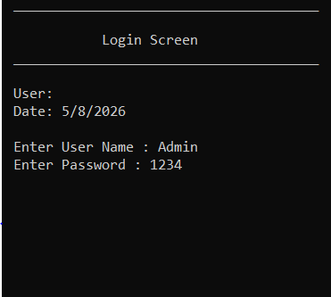
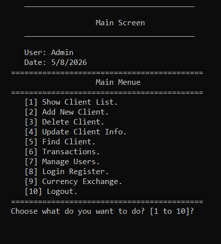
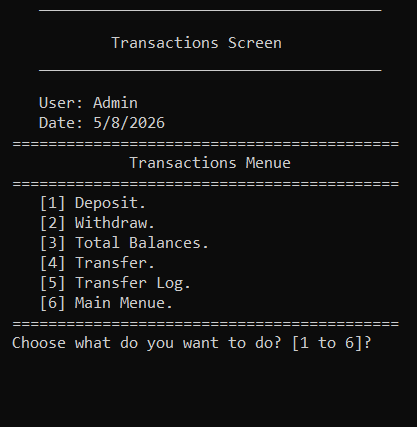

<h1 align="center">
  🏦 Bank Management System (OOP)
</h1>

<p align="center">
  
  
  
  
</p>

<p align="center">
  <b>A comprehensive, console-based Bank Management System built with advanced Object-Oriented Programming principles in C++.</b>
</p>

---

## 📝 Project Overview

**Bank Management System** is a  console application that simulates a real-world banking environment. Designed with a separation of concerns, the project features a fully functional text-based graphical user interface. It provides extensive capabilities for client and user management, secure transactions, and an integrated currency exchange module. Data persistence is handled efficiently via a custom text file database.

---

## ✨ Key Features

- **👥 Client Management**: Perform Complete CRUD operations (Add, Delete, Update, Find, List) for bank clients.
- **💰 Financial Transactions**: Handle deposits, withdrawals, fund transfers, and view total system balances. Includes a comprehensive transfer log.
- **🔐 User Management & Security**: Multi-tier user access (Admin vs. Standard User), secure login system with attempt tracking, and complete CRUD operations for managing system users.
- **💱 Currency Exchange Module**: List global currencies, find specific currencies, update exchange rates dynamically, and utilize a built-in currency calculator.
- **🧱 Object-Oriented Design**: Built using advanced Object-Oriented Programming (OOP) principles, including encapsulation, inheritance, polymorphism, and a clear separation of concerns for a scalable and maintainable codebase.

---

## 📂 Folder Structure

The project follows a professional and modular directory structure:

```text
Bank_Management_System/
├── 📄 Bank_Management_System.sln   # Visual Studio Solution File
├── 📄 Bank_Management_System.cpp   # Main Application Entry Point
├── 📄 Global.h                     # Global State (Logged-in User)
├── 📁 Core/                        # Core Entity Models
│   ├── clsBankClient.h
│   ├── clsCurrency.h
│   ├── clsPerson.h
│   └── clsUser.h
├── 📁 Lib/                           # Reusable Utilities & Libraries
│   ├── clsDate.h                     # Date Manipulation
│   ├── clsInputValidate.h            # Strict Input Validation
│   ├── clsString.h                   # String Parsing & Formatting
│   └── clsUtil.h                     # General Utilities (Encryption, Random)
├── 📁 Screens/                      # Presentation / UI Layer
│   ├── clsScreen.h                   # Base Screen Interface
│   ├── 📁 Client/                    # Client-related Screens (Deposit, Withdraw, etc.)
│   ├── 📁 Currency/                  # Currency Exchange Screens
│   └── 📁 User/                      # User Management & Login Screens
└── 📁 Data/                          # Text-based Database Files
    ├── Clients.txt
    ├── Currencies.txt
    ├── LoginRegister.txt
    ├── TransferLog.txt
    └── Users.txt
```

---
## 🛠️ Technologies & Tools

| Category | Technology |
| :--- | :--- |
| **Language** | C++ |
| **IDE** | Visual Studio 2022 |
| **Architecture** | Object-Oriented Programming (OOP) |
| **Data Storage** | Text Files (.txt) |
| **Version Control** | Git & GitHub |

---

## 🚀 Installation & Setup

1. **Clone the repository:**
   ```bash
   git clone https://github.com/Eng-MohammedAbdo/Bank-Management-System-OOP.git
   cd Bank_System_UI
   ```

2. **Open the Project:**
   - Double-click the `Project 3 Bank_System_UI.sln` file to open it in Visual Studio.

3. **Verify Data Directory:**
   - Ensure the `Data/` folder is located in the same directory as the `.vcxproj` file. The application relies on these text files for its database.

---
## 💻 How to Run

1. **Build the Application:**
   - In Visual Studio, press `Ctrl + Shift + B` (or go to **Build > Build Solution**).
2. **Run the Application:**
   - Press `F5` for debugging mode, or `Ctrl + F5` to run without debugging.
3. **Login:**
   - Use the default Admin credentials provided in the system (e.g., username `Admin`, password `1234` — *check `Users.txt` for exact credentials*).

---
## 📸 Screenshots

<div align="center">
  
| Login Screen | Main Menu |
| :---: | :---: |
|  |  |
| **Transactions Menu** | **Currency Exchange** |
|  |  |

</div>

---
## 📄 License & Credits

- **Author:** Mohammed Abdo Rashed
- **Purpose:** This project was developed for educational and portfolio purposes.
- **Notice:** You are welcome to study and learn from this project. Please do not redistribute or claim the code as your own without permission.
